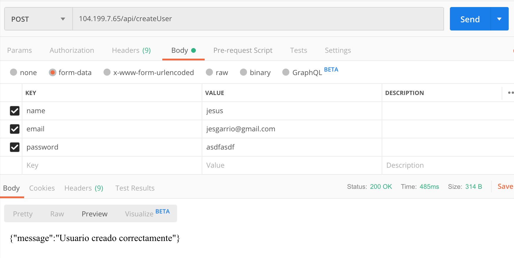
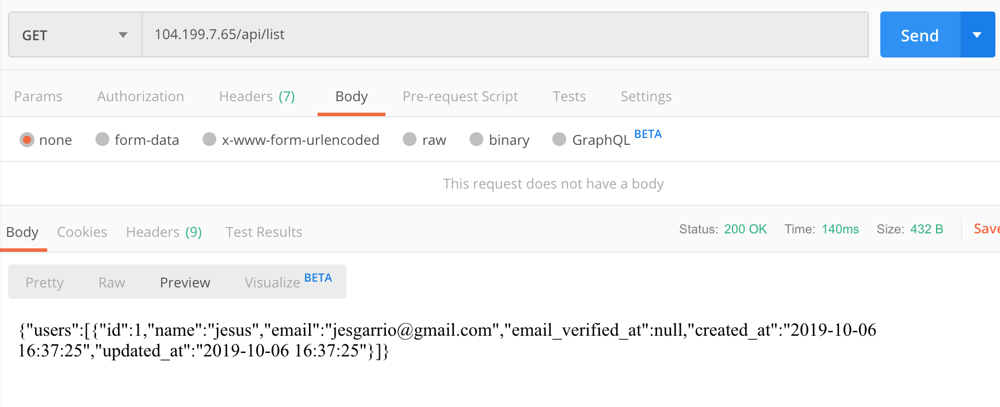

## App Description

This is a sample Laravel Project. We are using Laravel 6, PHP 7.2 and MySQL as Database.

## Functionality 

In local, you can register using localhost:$PORT. $PORT is specified in root project .env.
If you want to test Laravel DB, just do a POST call to the following 

```localhost:$PORT/api/createUser``` 

and you have to pass as params the following fields: name, email and password.



If you want to check it works, just list using a GET call to:



```localhost:$PORT/api/list```


Note: Use Sofware like Postman in order to check it out
#How to deploy in local

Just go to root project and execute

`docker-compose up --build -d`

#How to deploy in Kubernetes
First, create a namespace and change the context.
Then, you will have to create a secret, in order to satisfy our k8s project, execute similar command:
`kubectl create secret generic laravel-secret --from-literal=db_password=root --from-literal=encrypted_key='base64:+5EKn7wOp0Bg4ALke82sUSzoQxM+QpNKkuxaGE4w4DI=' --dry-run -o yaml > secret.yaml`

And then just `kubectl apply -f .`

You strongly must install Nginx Controller, if you don't have the namespace in your cluster, just do the following:

FOR GKE

```kubectl create clusterrolebinding cluster-admin-binding --clusterrole cluster-admin --user $(gcloud config get-value account)```

```kubectl apply -f https://raw.githubusercontent.com/kubernetes/ingress-nginx/master/deploy/static/mandatory.yaml```

```kubectl apply -f https://raw.githubusercontent.com/kubernetes/ingress-nginx/master/deploy/static/provider/cloud-generic.yaml```

If you use this in a new cluster, you will have to change the IP in ingress-nginx.yaml and change it for the External Ip which appears in the following sentence:
```k -n ingress-nginx get svc```